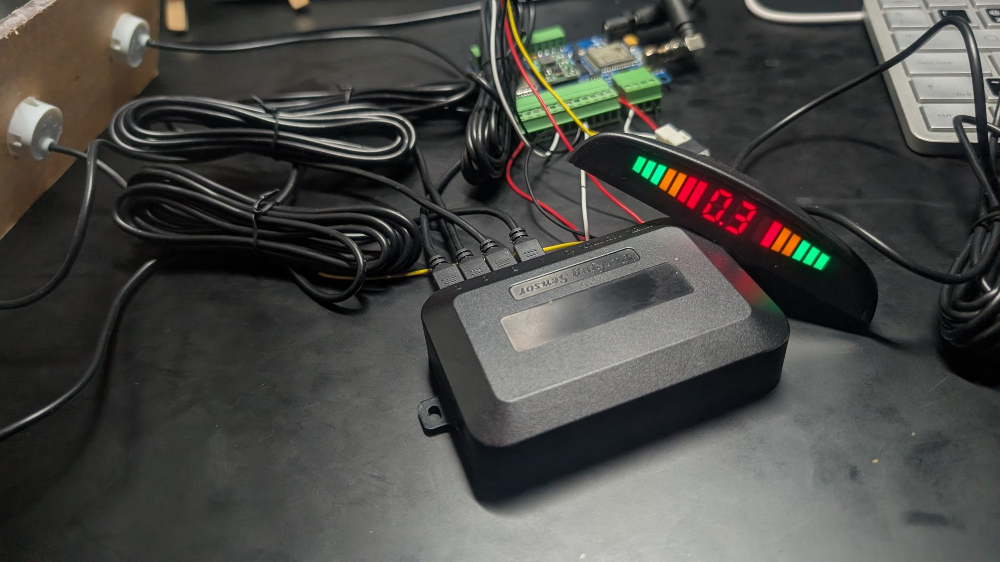
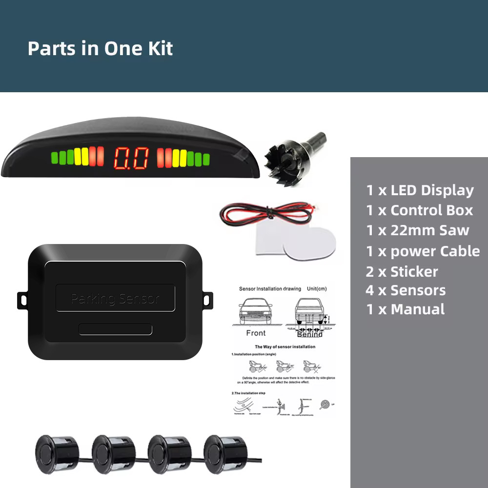
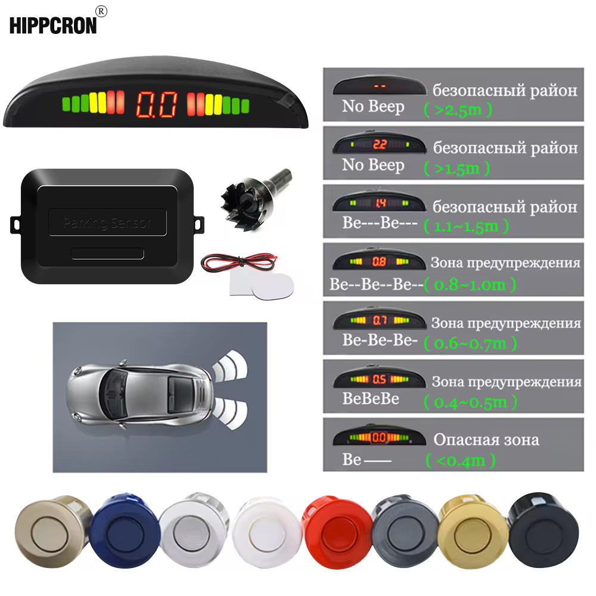
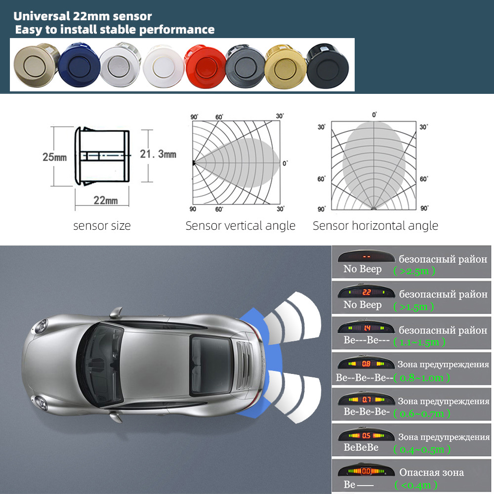
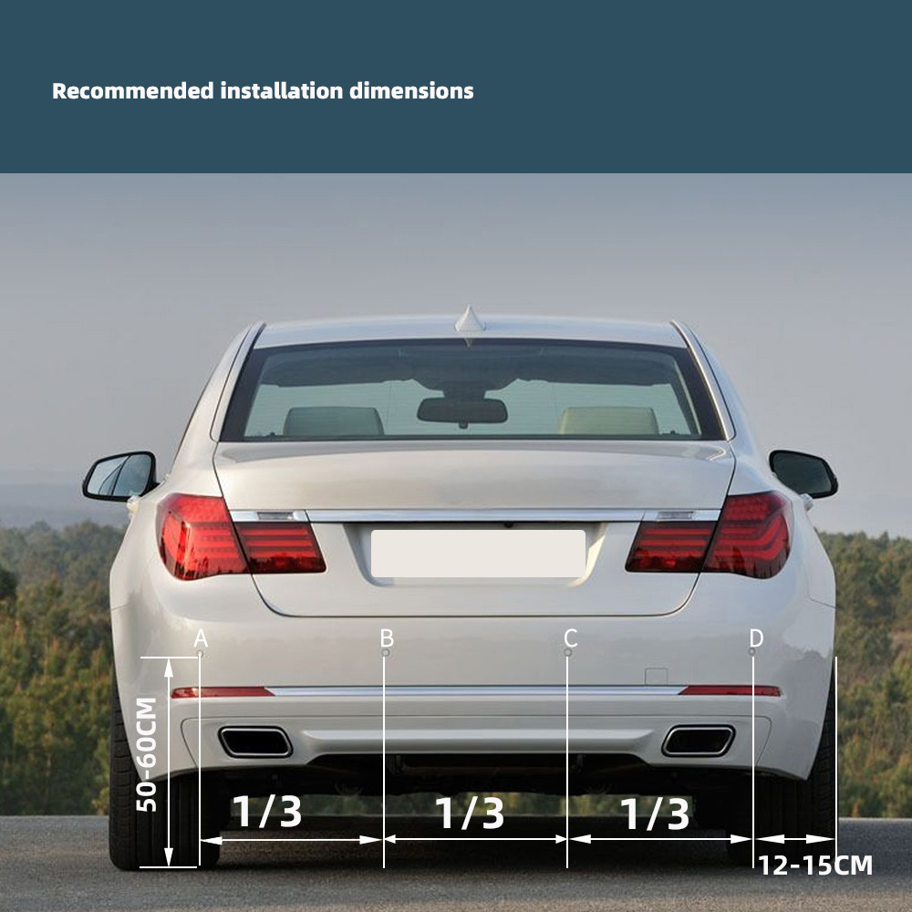

# Ultrasonic Parking Sensor

Arduino library for transmitting and decoding the four-channel ultrasonic
parking sensor protocol. `ParkingDisplay` drives the display, while
`ParkingController` decodes the original controller signal.



## Hardware reference

| Kit contents | Display and operating ranges |
| --- | --- |
|  |  |
| Ultrasonic sensor dimensions and detection angles | Recommended sensor placement |
|  |  |

## Controller and connectors

The ultrasonic parking sensor controller used for this project is model
**A43** and operates from **12 V**. With the controller connector side facing
up, the ports are arranged as follows (not to scale):

```text
LEFT                                                               RIGHT
+----------------------+----------+--------------------+------------------+
| 4 ultrasonic sensors |  Buzzer  |   Display output   |   Power input    |
|                      |          | S | 12V | 5V | GND | 12V | NC | GND  |
+----------------------+----------+--------------------+------------------+
```

The supplied display cable has only three populated wires: `S`, `12V`, and
`GND`. The `5V` position on the controller's display connector is not used by
the display cable. Its output current rating is unknown, so do not use it to
power a microcontroller or other hardware unless the controller is measured
and verified first.

Keep the 12 V connections away from microcontroller GPIO pins. Connect only
the display signal through an appropriate interface and share ground. Measure
the signal voltage first and use a level shifter or resistor divider if it
exceeds the microcontroller's GPIO voltage rating.

## Driving the display

```cpp
#include <ParkingDisplay.h>

ParkingDisplay display(32);

void setup() {
    display.begin();

    // Sensor order: A left outer, B left mid, C right mid, D right outer.
    display.setDistancesMeters(1.2f, 0.8f, 2.0f, 1.5f);
}

void loop() {
    display.update();
}
```

Call `update()` frequently; the library handles the refresh interval.

`setDistancesMeters()` accepts readings from `0.0` to `2.5` metres. Readings
up to `0.2` select the display's close-object indication instead of numeric
digits. Negative values, `NaN`, and readings above `2.5` are sent as no
reading.

For already-quantized data, use `setDistancesTenths()`. Values `0` through
`2` mean close, `3` through `25` represent `0.3` through `2.5` metres, and
`ParkingDisplay::NO_READING` disables one sensor reading.

Individual readings use the labels printed on the controller:
`ParkingDisplay::SENSOR_A` is left outer, `SENSOR_B` is left mid, `SENSOR_C`
is right mid, and `SENSOR_D` is right outer.

The project's example sketch also accepts four readings from the serial
monitor at 115200 baud:

```text
v 1.6 1.2 1.1 1.0
```

The serial input order follows the controller labels from left to right:
A left outer, B left mid, C right mid, D right outer. The library handles the
display's unusual wire order internally.

## Decoding the controller

`ParkingController` decodes the controller signal using an edge
interrupt. The `ControllerDecoder` example prints complete frames using the
controller labels from left to right: A left outer, B left mid, C right mid,
D right outer.

```cpp
#include <ParkingController.h>

ParkingController controller(32);

void setup() {
    controller.begin();
}

void loop() {
    ParkingControllerFrame frame;
    if (controller.read(frame)) {
        // sensorA = left outer, sensorB = left mid,
        // sensorC = right mid, sensorD = right outer.
    }
}
```

The controller receives distance data from its four ultrasonic sensors before
encoding the readings on the display signal.

## Protocol

The protocol is a one-wire, pulse-width-encoded signal. The line is normally
LOW. A frame contains a sync sequence, one leading pulse, and four sensor
bytes:

| Part | Level | Nominal duration |
| --- | --- | ---: |
| Sync | HIGH | 1900 us |
| Sync gap | LOW | 1000 us |
| Data lead-in | HIGH | 100 us |
| Sensor data | alternating LOW/HIGH | 32 bits total |

Each data bit takes approximately 300 us. The LOW and HIGH widths identify
the bit value:

| Bit | LOW duration | HIGH duration |
| ---: | ---: | ---: |
| `0` | 200 us | 100 us |
| `1` | 100 us | 200 us |

Bits are sent most-significant bit first. After the lead-in, the 32 data bits
form four bytes in this physical wire order:

| Byte | Sensor |
| ---: | --- |
| 0 | A left outer |
| 1 | D right outer |
| 2 | C right mid |
| 3 | B left mid |

The public library API rearranges these into controller-label order:
A left outer, B left mid, C right mid, D right outer.

### Distance values

Each byte is the distance in tenths of a metre:

| Byte value | Meaning |
| ---: | --- |
| `0x00`-`0x02` | Close object; the display shows its close warning instead of a number |
| `0x03`-`0x19` | `0.3`-`2.5` metres |
| `0xFF` | No sensor reading |

Values above `0x19` do not produce a numeric distance. The display calculates
the left and right bar graphs from their respective sensor pairs and shows
the closest active sensor on the centre digits.

For example, these logical readings:

```text
A left outer=1.6, B left mid=1.2, C right mid=1.1, D right outer=1.0
```

are encoded on the wire as:

```text
0x10 0x0A 0x0B 0x0C
  A    D    C    B
```

The active portion of a frame is about 12.6 ms long. The transmitter then
holds the line LOW before sending the next frame. This library uses a 20 ms
LOW gap between transmitted frames.

The receiver accepts some timing variation: 1500-2400 us for sync HIGH,
700-1300 us for sync LOW, 50-150 us for a short pulse, and 151-280 us for a
long pulse. A frame with an invalid pulse pair is discarded.
